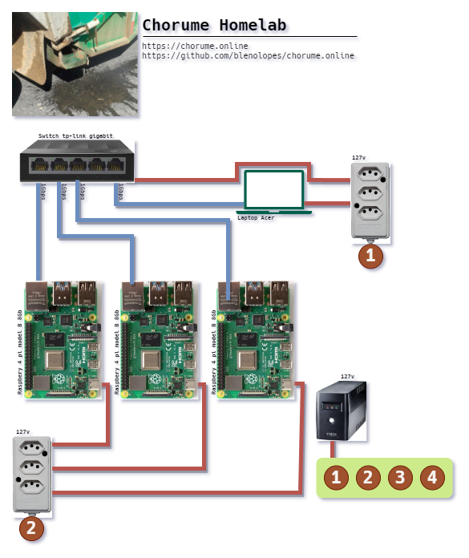

# CHORUME.ONLINE

Este é um projeto de homelab chamado **Chorume**, "o caldinho que cai do caminhao de lixo".

## Tecnologias utilizadas

O **Chorume** faz uso das tecnologias e softwares:

### Hardware

- 3x Raspbery pi 4 model b 8Gb ram
- 1x Switch tp-link gigagit
- 1x nobreak Intelbras 127v de 600va
- 2x tomadas padrao brasileiro de 127v 10A
- 6 cabos utp cat 6
- Cabos eletricos de 127v 10A

### Software

- Ubuntu Server 23.10 arm64
- docker, docker-compose e postman
- Traefik
- Ansible e ansible-lint
- Python
- VSCode

## Configuração

...

## Contribuição

...

## Licença

Este projeto usa a MIT License, [clique aqui!](LICENSE)

## Contato

Se você tiver alguma dúvida ou sugestão, entre em contato:

- Email: <blenolopes@gmail.com>
- GitHub Issues: [Issues](https://github.com/blenolopes/chorume.online/issues)
